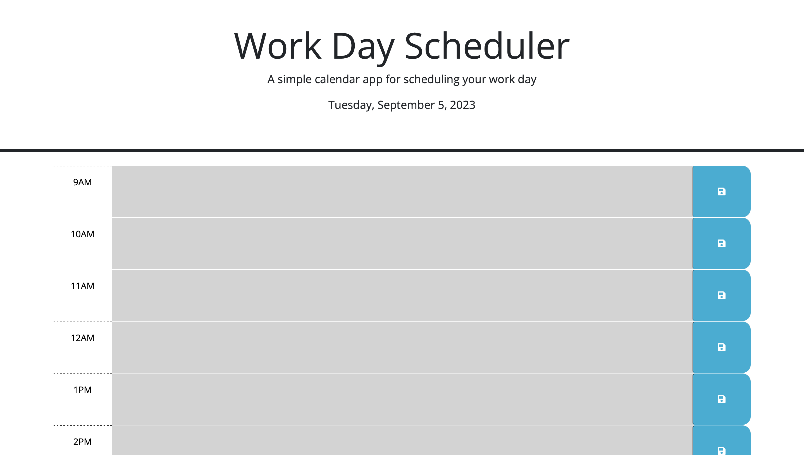

# WorkPlanPro

## Description

I developed this website to help people better organize and simplify their tasks for improved efficiency.
The website uses a color-coding system: past events are represented in grey, current events in red, and upcoming events in green. One thing I learned from building this website is the power of using tools like Day.js to efficiently work with time and dates. Day.js allowed me to effectively handle and display dates on the website, simplifying the task of providing real-time information to users and enhancing their overall experience.

https://raymond2811.github.io/WorkPlanPro/

## Usage

This website is user-friendly. All you need to do is enter your events or to-do items and click the blue 'Save' button on the right.

## License

MIT License